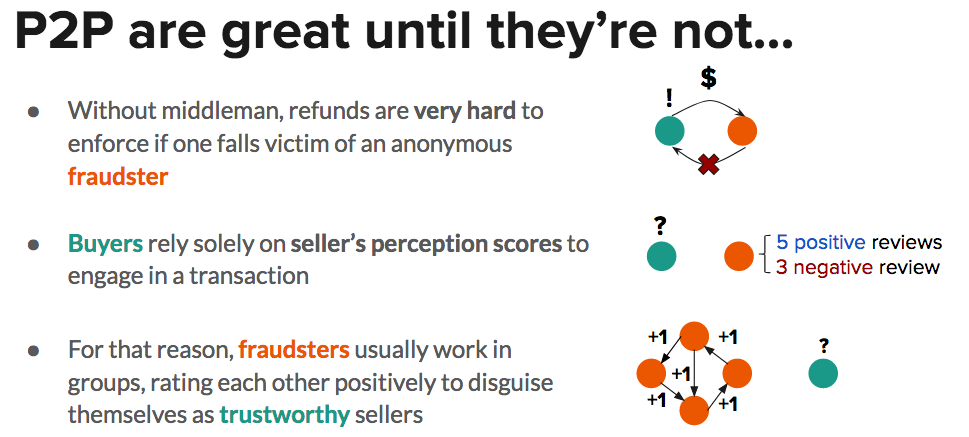
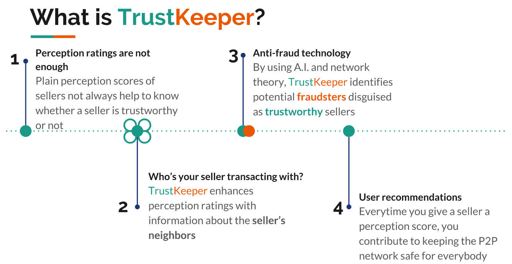

# TrustKeeper

# How users keep track of sellers' perception scores in P2P networks

# Enter TrustKeeper

# A step-by-step implementation of TrustKeeper is found in the Jupyter Notebook.
Network data from [SNAP](http://snap.stanford.edu/data/index.html)
